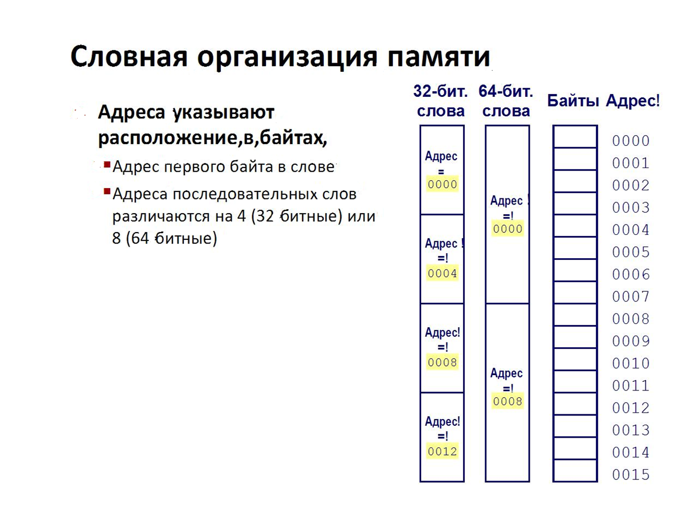
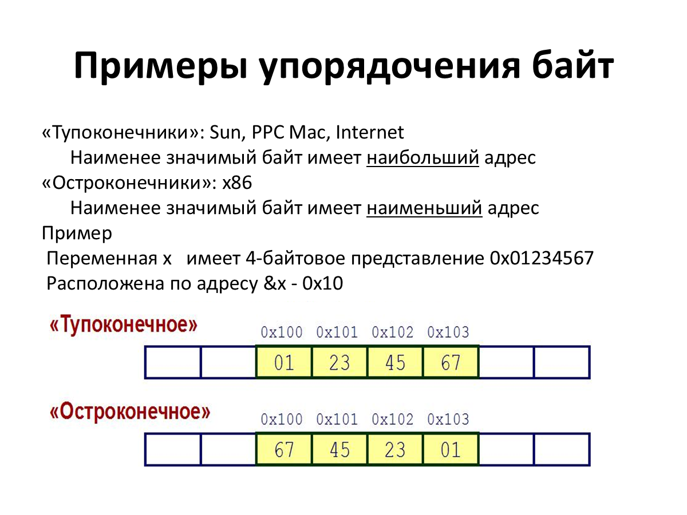
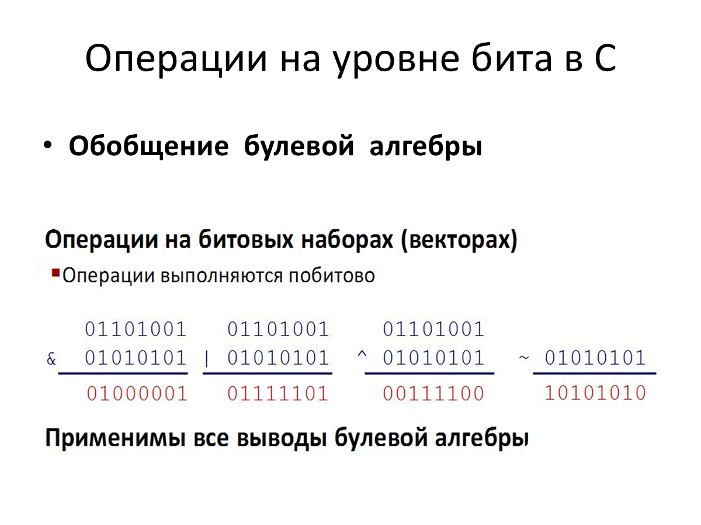
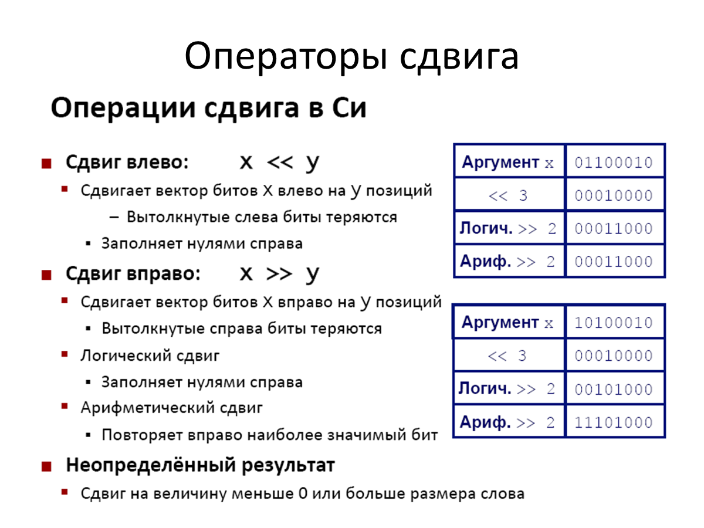
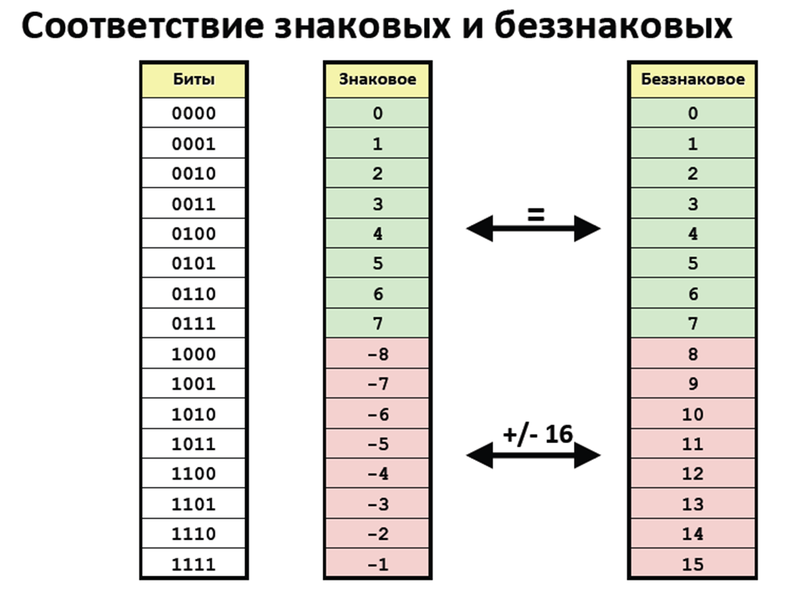
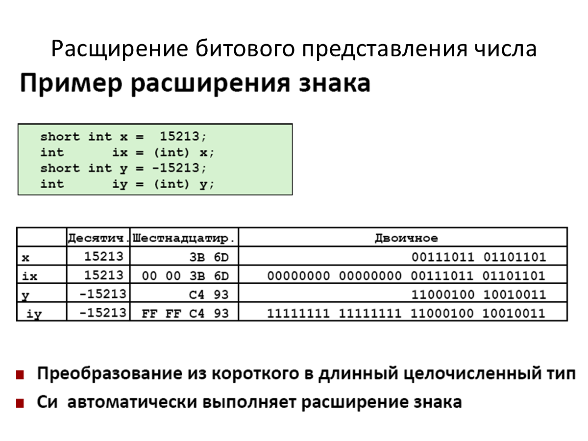
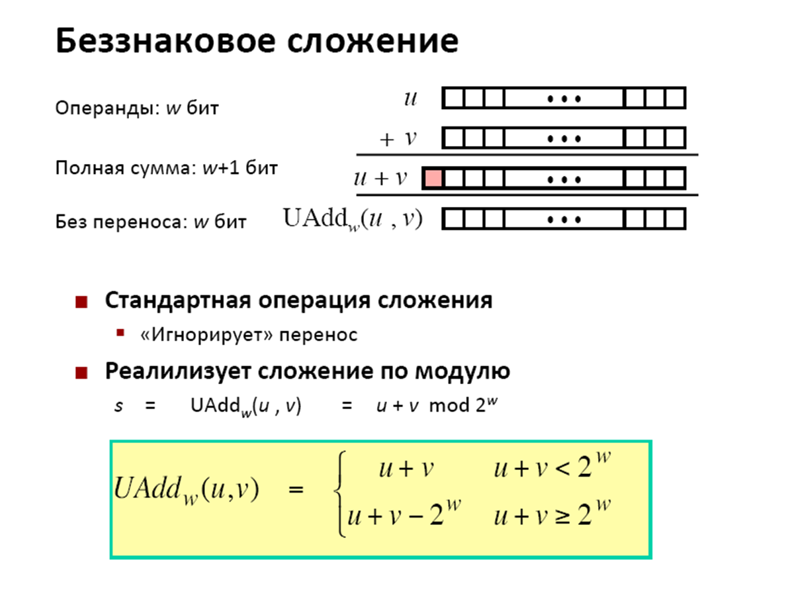

# Компьютерные основы: представление данных

## Биты и байты

- **Бит** принимает значение `0` или `1`. Наборами битов кодируют инструкции, числа, строки и множества.
- **Байт = 8 бит**, то есть 256 комбинаций. Беззнаковое значение байта: от `0` до `255` (`00000000`–`11111111`, или `00`–`FF`).
- В шестнадцатеричной системе используют `0–9` и `A–F`. Одна цифра соответствует 4 битам, байт — двум цифрам. В Си запись начинается с `0x`.
- **ASCII** сопоставляет символам числовые коды.

## Память и машинное слово

- Память представляется массивом байтов с адресами. ОС предоставляет каждому процессу собственное виртуальное адресное пространство.
- **Машинное слово** — обычный для машины размер представления целых чисел и адресов: 32 бита (4 байта) или 64 бита (8 байт).
- 32-битовый адрес позволяет адресовать 4 ГБ памяти.
- Адрес слова — адрес его первого байта. Последовательные слова занимают 4 или 8 байт соответственно.
- Размеры типов и указателей зависят от платформы. В примерах презентации: `char` — 1 байт, `short` — 2, `int` — 4, `long long` — 8, `float` — 4, `double` — 8. Размеры `long` и указателей различаются между платформами.

## Порядок байтов

Многобайтовое число может храниться двумя способами. Для `0x01234567` по возрастанию адресов:

- **«Тупоконечный» порядок:** старший байт первым — `01 23 45 67`.
- **«Остроконечный» порядок (x86):** младший байт первым — `67 45 23 01`.

Порядок байтов важен при чтении памяти и машинного кода. **Дизассемблирование** даёт текстовое представление машинных инструкций.

## Булева алгебра и операции в Си

Истина кодируется как `1`, ложь — как `0`. Побитовые операции применяются отдельно к каждому биту целого числа:

| Операция | Оператор | Когда результат равен 1 |
| --- | --- | --- |
| И | `&` | Оба бита равны 1 |
| ИЛИ | `\|` | Хотя бы один бит равен 1 |
| Исключающее ИЛИ | `^` | Биты различаются |
| НЕ | `~` | Исходный бит равен 0 |

Битовый вектор может представлять множество: бит `i` равен `1`, если элемент `i` входит в множество. Тогда `&` даёт пересечение, `|` — объединение, `^` — симметрическую разность, `~` — дополнение.

**Логические операторы** `&&`, `||`, `!` работают со значениями целиком: `0` означает ложь, любое ненулевое значение — истину. Результат всегда `0` или `1`. Вычисление `&&` и `||` прекращается, как только результат известен.

## Сдвиги

- `x << y` сдвигает биты влево на `y` позиций, справа добавляет нули.
- `x >> y` сдвигает биты вправо. При **логическом сдвиге** слева добавляются нули, при **арифметическом** повторяется знаковый бит.
- Биты, вышедшие за границу разрядной сетки, теряются.

## Целые числа и дополнительный код

Для числа длиной **w бит**:

| Представление | Диапазон | Пример для 8 бит |
| --- | --- | --- |
| Без знака | от 0 до 2^w − 1 | 0…255 |
| Со знаком, дополнительный код | от −2^(w−1) до 2^(w−1) − 1 | −128…127 |

- В дополнительном коде старший бит имеет вес `−2^(w−1)`: `0` означает неотрицательное число, `1` — отрицательное.
- Чтобы получить код противоположного числа, инвертируют биты и прибавляют единицу: `~x + 1` в пределах выбранной разрядности.
- Один набор битов может означать разные числа: `11111111` — это `255` без знака или `−1` в дополнительном коде.
- Отрицательных значений на одно больше, чем положительных. Границы целых типов в Си задаются константами из `<limits.h>`.

## Преобразования целых чисел

- При смене знаковой интерпретации без изменения разрядности сохраняется набор битов, но значение может измениться на `2^w`.
- В выражении с `int` и `unsigned int` значение `int` преобразуется в `unsigned int`. Поэтому `−1 < 0` истинно, а `−1 < 0U` ложно.
- **Расширение:** беззнаковое число дополняют слева нулями, знаковое — копиями знакового бита. Значение сохраняется.
- **Усечение:** старшие биты отбрасывают, оставшиеся трактуют с учётом новой длины и типа. Значение может измениться.

## Сложение и переполнение

- Полная сумма двух w-битовых чисел может требовать `w + 1` бит.
- **Беззнаковое сложение:** лишний перенос отбрасывается, результат равен `(u + v) mod 2^w`.
- В рассмотренной модели **сложения в дополнительном коде** биты складываются так же, а оставшиеся w бит читаются как знаковое число.
- **Переполнение** возникает, если сумма выходит за диапазон представления. В этой модели при положительном переполнении вычитается `2^w`, при отрицательном прибавляется `2^w`, и знак результата меняется.
- Сложение по модулю коммутативно и ассоциативно, имеет нейтральный элемент `0` и обратный элемент для каждого значения.

