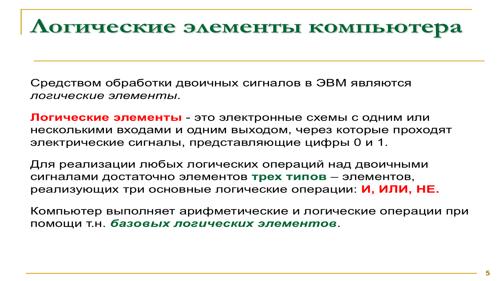
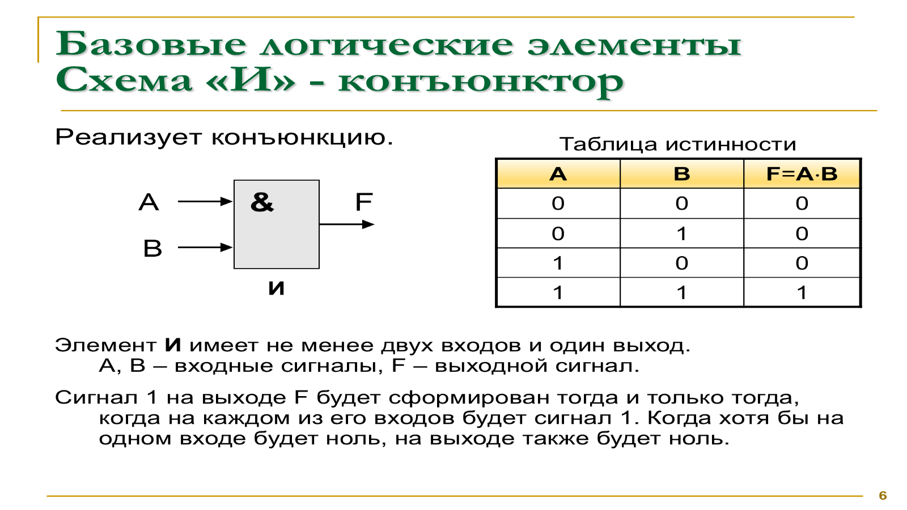
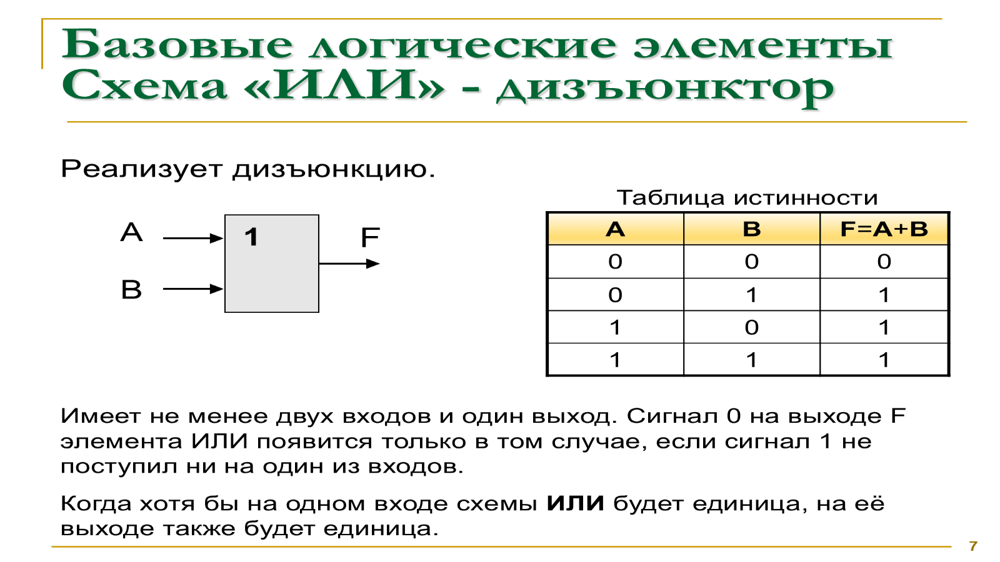
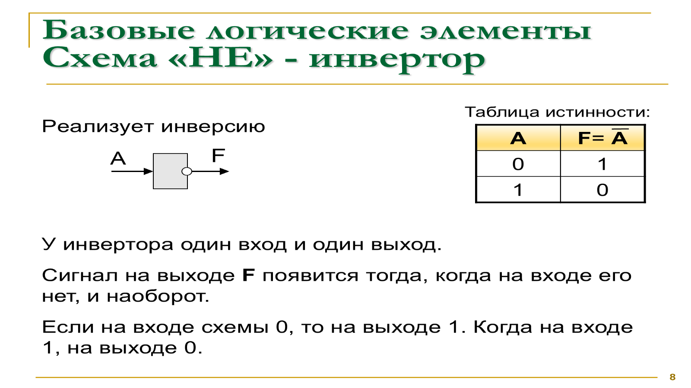
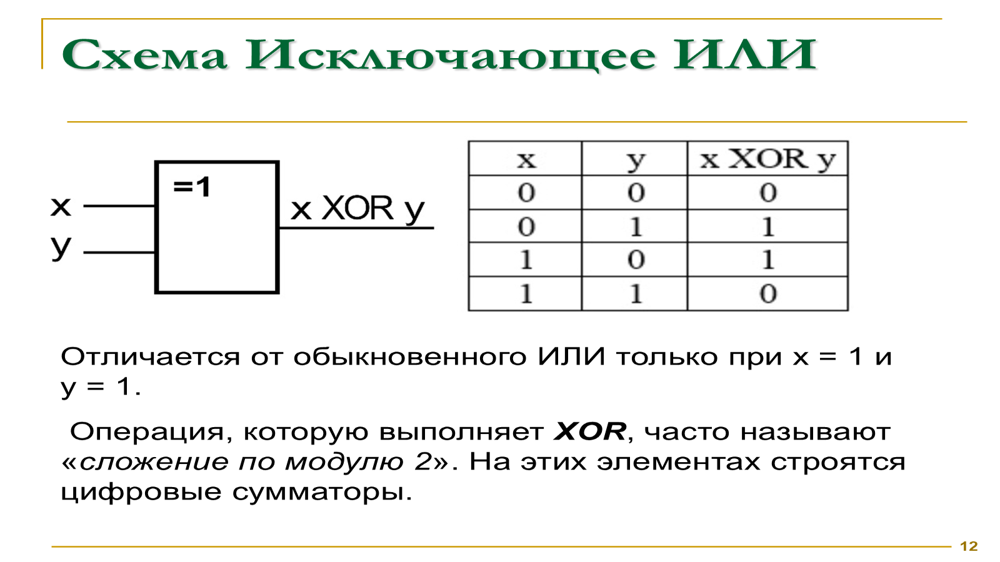
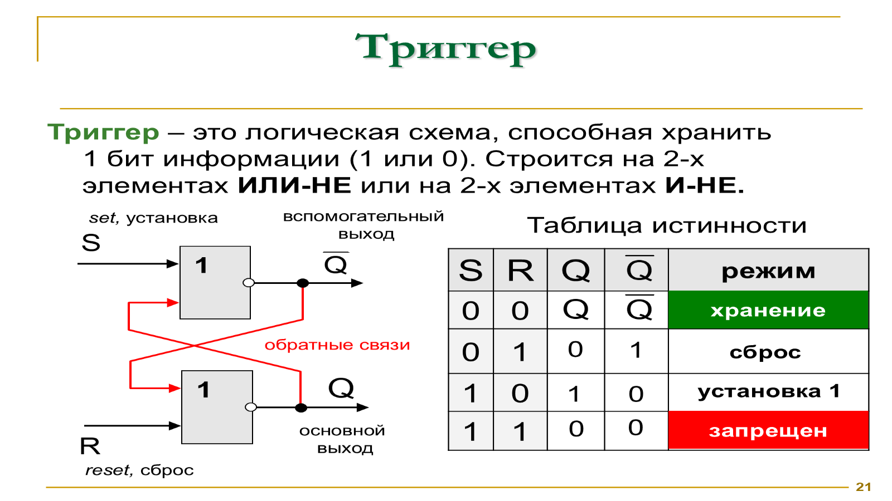
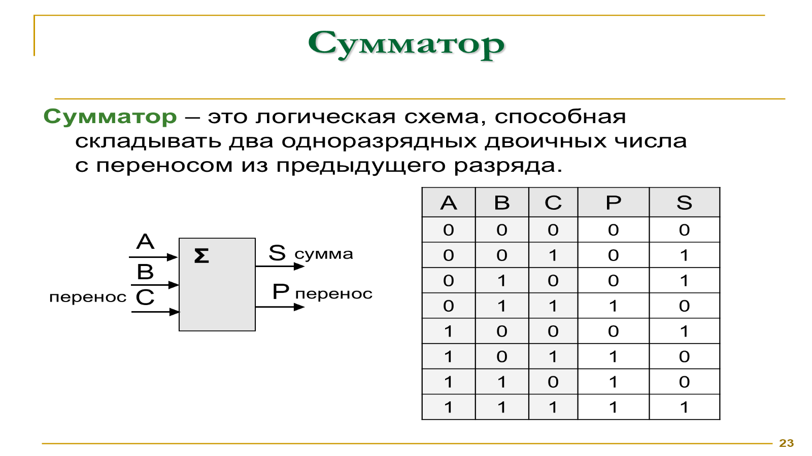
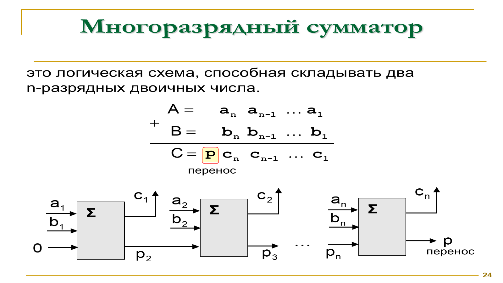
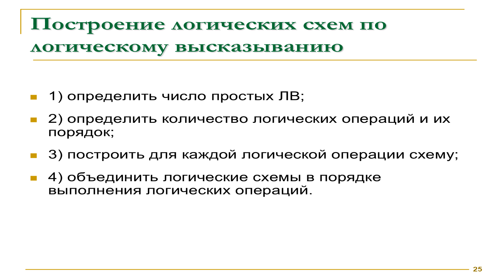

# Логические элементы и сумматор

## Логические основы компьютера

- Компьютер обрабатывает числа и символы, закодированные последовательностями `0` и `1`.
- Электрический сигнал может обозначать логическую единицу, а его отсутствие — логический ноль.
- Чарльз Пирс заметил связь двоичной логики с электрическими переключательными схемами.
- Клод Шеннон связал двоичное кодирование, булеву алгебру и релейные схемы. На этой основе строятся цифровые устройства.

## Логические элементы

**Логический элемент** — электронная схема с одним или несколькими входами и одним выходом. Она принимает сигналы `0` и `1` и формирует результат по таблице истинности.

Для выполнения любых логических операций достаточно трёх базовых элементов: **И**, **ИЛИ** и **НЕ**.

### И (конъюнктор)

Элемент И имеет не менее двух входов. На выходе появляется `1`, только если на всех входах находится `1`.

| A | B | A И B |
| --- | --- | --- |
| 0 | 0 | 0 |
| 0 | 1 | 0 |
| 1 | 0 | 0 |
| 1 | 1 | 1 |

### ИЛИ (дизъюнктор)

На выходе элемента ИЛИ находится `1`, если хотя бы на одном входе находится `1`. Ноль получается только при нулях на всех входах.

| A | B | A ИЛИ B |
| --- | --- | --- |
| 0 | 0 | 0 |
| 0 | 1 | 1 |
| 1 | 0 | 1 |
| 1 | 1 | 1 |

### НЕ (инвертор)

Инвертор имеет один вход и меняет значение сигнала на противоположное.

| A | НЕ A |
| --- | --- |
| 0 | 1 |
| 1 | 0 |

## Комбинированные элементы

- **И-НЕ** выполняет операцию И, затем инвертирует результат.
- **ИЛИ-НЕ** выполняет операцию ИЛИ, затем инвертирует результат.
- **Исключающее ИЛИ (XOR)** выдаёт `1`, когда входные значения различаются. Операцию также называют сложением по модулю 2.

| A | B | A XOR B |
| --- | --- | --- |
| 0 | 0 | 0 |
| 0 | 1 | 1 |
| 1 | 0 | 1 |
| 1 | 1 | 0 |

Любую логическую операцию и сложное цифровое устройство можно построить из базовых элементов. На их основе создают триггеры, сумматоры, регистры, счётчики, шифраторы и дешифраторы.

## Триггер

**Триггер** — логическая схема, которая хранит один бит информации. У неё два устойчивых состояния, соответствующие `0` и `1`.

- Триггер можно построить из двух элементов ИЛИ-НЕ или двух элементов И-НЕ.
- Вход `S` устанавливает единицу, а вход `R` выполняет сброс.
- Обратные связи позволяют схеме сохранять состояние после изменения входного сигнала.
- Триггеры применяются в регистрах и других устройствах хранения данных.

## Сумматор

**Сумматор** — логическая схема для сложения двоичных чисел. Он лежит в основе арифметического устройства компьютера.

Одноразрядный сумматор складывает два бита и входной перенос из предыдущего разряда. На выходе он формирует бит суммы и перенос в следующий разряд.

**Многоразрядный сумматор** складывает два числа из `n` разрядов. Его получают соединением одноразрядных сумматоров: перенос каждого разряда поступает на вход следующего.

## Построение логической схемы

Чтобы построить схему по логическому выражению:

1. Определить входные переменные.
2. Определить логические операции и порядок их выполнения.
3. Построить элемент для каждой операции.
4. Соединить элементы в порядке вычисления выражения.

Чтобы получить выражение по готовой схеме, нужно записывать результат после каждого элемента, двигаясь от входов к последнему выходу.

