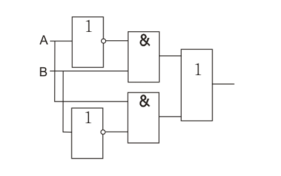
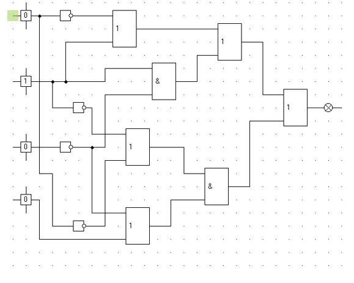
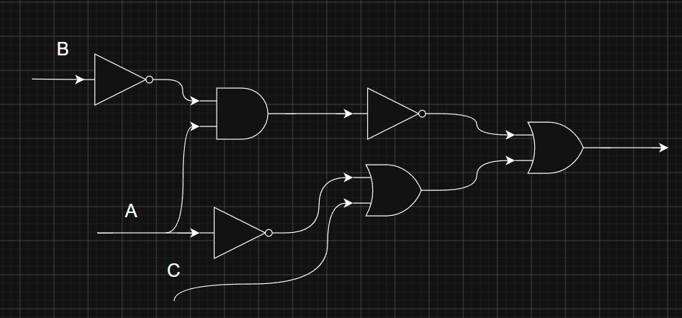
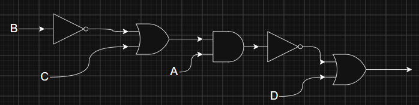

# Домашние задания к уроку 2

## Что надо было сделать

### 1 Часть, из схемы в формулу

### 2 Часть, из формулы в схему

- (A ∧ ¬B) → (C ∨ ¬A)

- ¬(A ∧ (B → C)) ∨ D

## Решение

### 1 Часть

- **Схема 1:**
    **`(¬A ∧ B) ∨ (A ∧ ¬B)`**.

- **Схема 2.** Обозначил входы к сверху вниз как `A`, `B`, `C`, `D`:
    **`((¬A ∨ B) ∨ (B ∧ ¬C)) ∨ ((¬B ∨ ¬A) ∧ (¬C ∨ D))`**;

### 2 Часть

- **Формула 1:**
    **`(A ∧ ¬B) → (C ∨ ¬A)`**

- **Формула 2:**
    **`¬(A ∧ (B → C)) ∨ D`**

