# Процессор: теория

Конспект по презентации «проц теория».

## Элементы процессора

Основные элементы процессора:

- **Дешифратор команд** определяет операцию по её коду.
- **Операционные устройства**, в том числе арифметико-логическое устройство (АЛУ), выполняют действия над данными.
- **Устройство управления (УУ)** формирует сигналы, которые задают порядок работы остальных устройств.
- **Регистры** хранят данные, адреса и промежуточные результаты.
- **Транслятор адресов операндов** участвует в формировании адресов данных.
- **Шины** соединяют устройства и передают информацию.

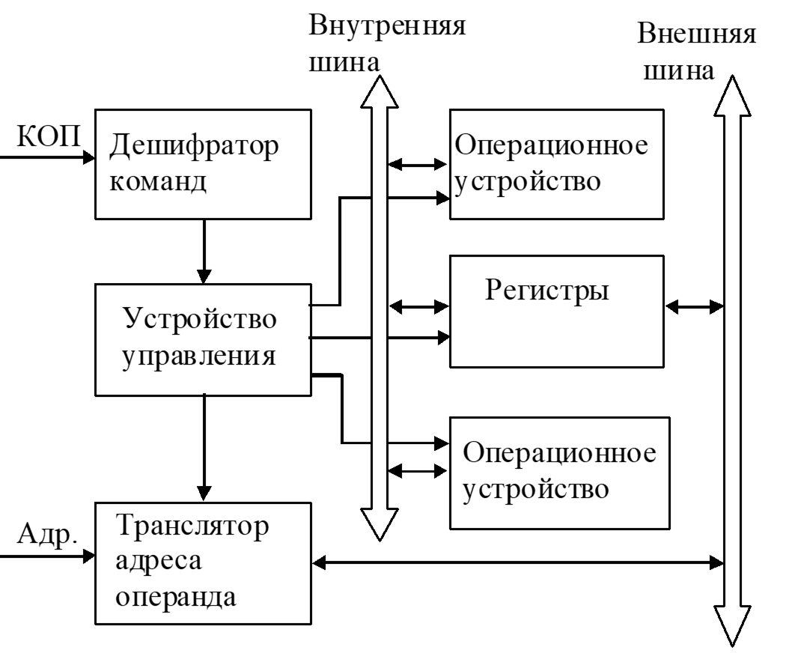

Процессор взаимодействует с другими устройствами через линии адреса, данных и управления. Также ему нужны тактовые сигналы и питание. От внешних устройств могут поступать запросы прерывания.

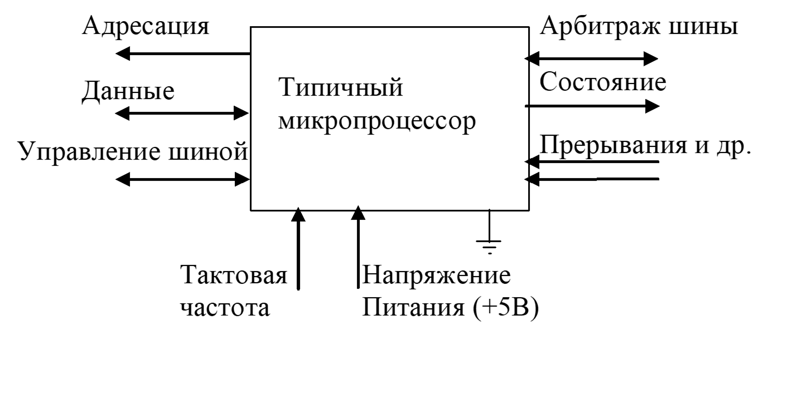

В презентации в качестве исторического примера приведён Intel 4004, появившийся в 1971 году.

## Операционные устройства

Операционные устройства выполняют целочисленные, логические, десятичные операции, сдвиги, операции с числами с плавающей точкой и графические операции.

**Структурный базис** операционного устройства состоит из:

- регистров для хранения слов данных;
- шин для передачи слов между регистрами;
- комбинационных схем для вычислений по сигналам устройства управления.

### Регистры

**Регистр** — набор триггеров, который хранит двоичное слово. Каждый триггер хранит один бит.

Регистры бывают:

- явно видимыми программе;
- видимыми косвенно, например «теневые» регистры дескрипторов сегментов;
- внутренними регистрами специального назначения, например регистрами адреса и данных памяти;
- внутренними регистрами промежуточных результатов.

На схеме передача из одного регистра в другой проходит через вентили. Управляющий строб разрешает передачу данных.

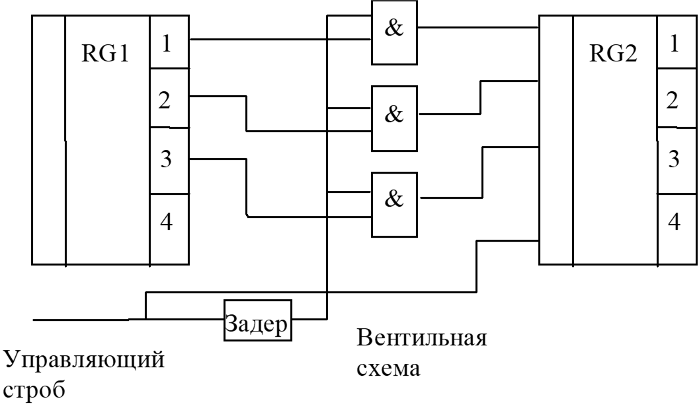

### Мультиплексор

Мультиплексор позволяет выбирать, какие данные передать дальше. На приведённой в презентации схеме показаны вентили, регистр-приёмник и стробы, которые задают моменты изменения его состояния.

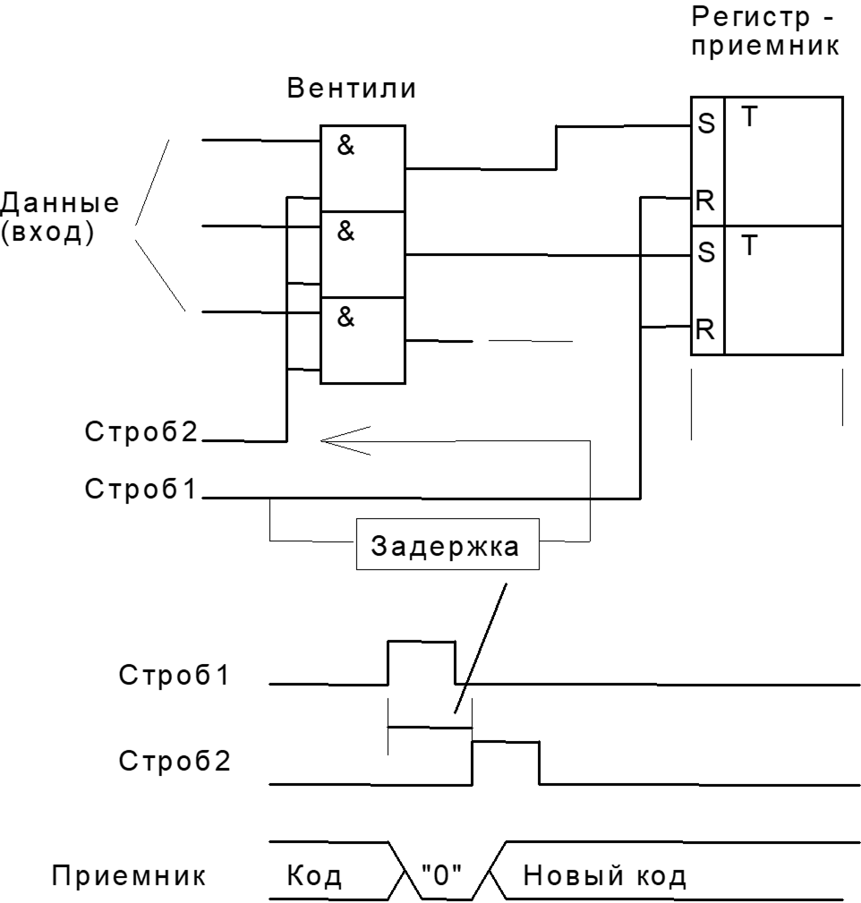

### Арифметико-логическое устройство

**АЛУ** принимает два операнда и формирует результат выбранной операции. Рассматриваемое здесь АЛУ является комбинационной схемой: внутри него нет элементов памяти.

Код операции определяет, какой результат нужно подать на выход.

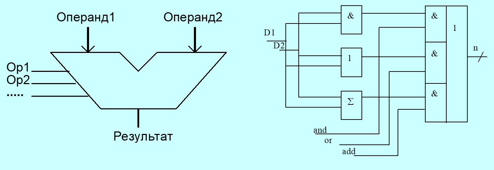

В принципиальную схему АЛУ входят логическое устройство, полный сумматор и декодер операции.

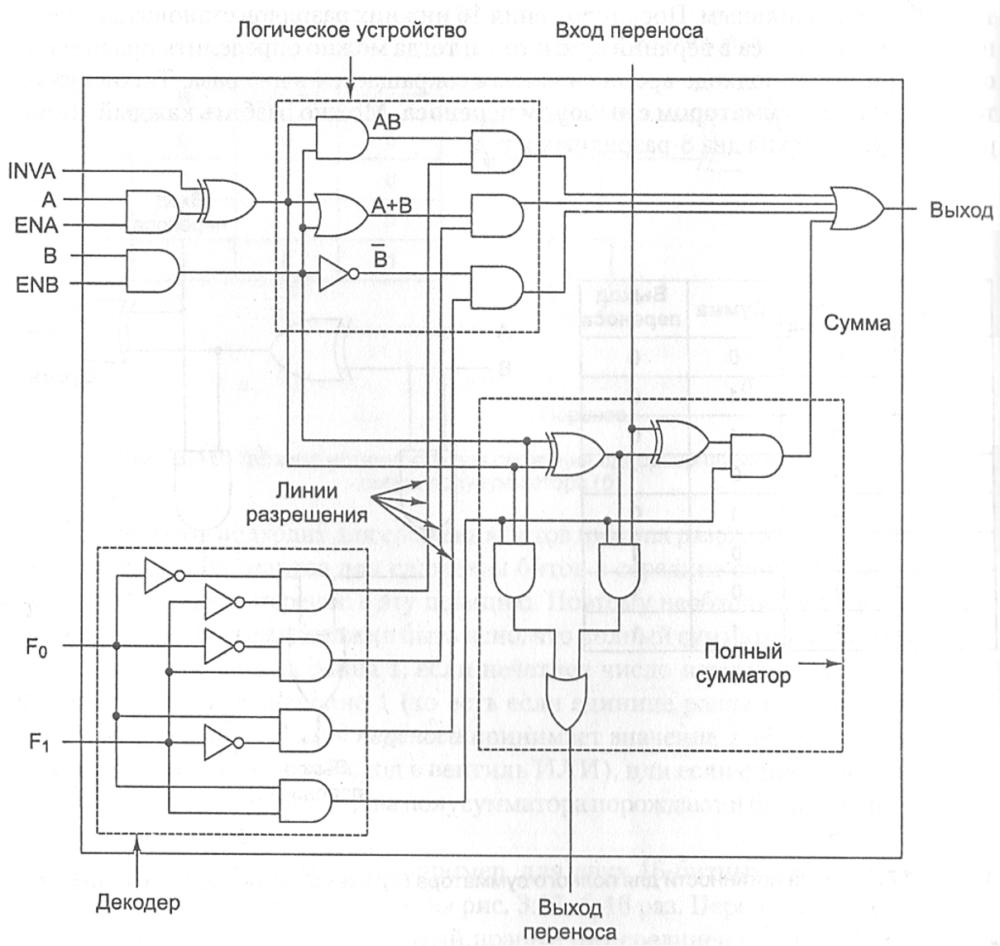

Восьмиразрядное АЛУ можно составить из восьми одноразрядных АЛУ. Выход переноса одного разряда соединяется со входом переноса следующего.

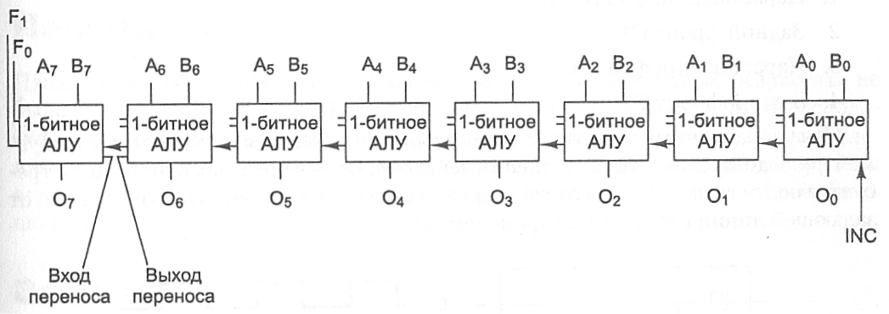

### Простейшие операции

В презентации показаны три примера:

| Команда | Действие |
| --- | --- |
| `mov R1, R2` | Пересылка данных между регистрами |
| `rol R0` | Циклический сдвиг содержимого регистра |
| `add R0, R1` | Сложение операндов |

Для сложения нужно передать операнды на входы АЛУ, выполнить операцию и записать результат в регистр. Эти действия проходят по управляющим сигналам в определённые такты.

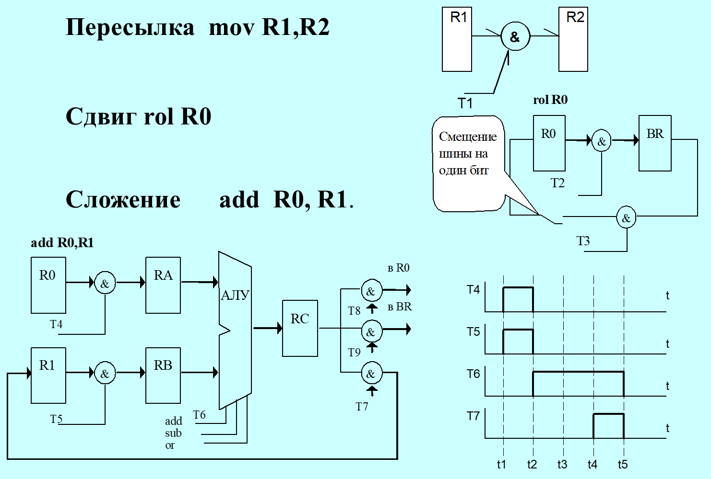

## Связь операционных устройств с шинами

На схеме тракта данных машины фон Неймана два операнда из регистров поступают в входные регистры АЛУ. После операции результат попадает в выходной регистр и возвращается в набор регистров.

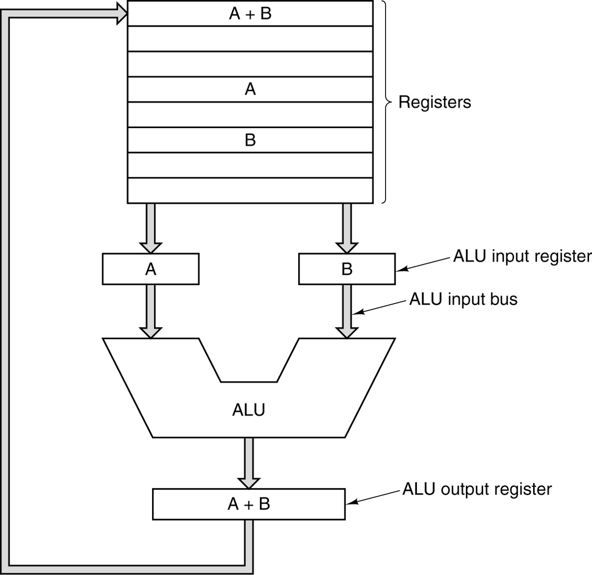

В магистральной структуре несколько устройств используют общие шины. Мультиплексоры выбирают регистры-источники, а демультиплексор направляет результат в нужный регистр.

**РОН** — регистры общего назначения. **ОПБ** — операционный блок.

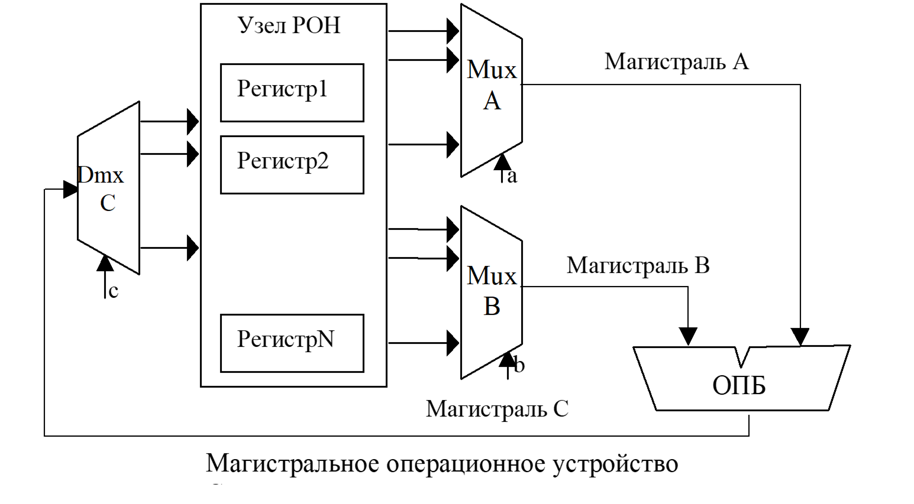

Различают трёхмагистральные, двухмагистральные и одномагистральные операционные устройства. На схемах с меньшим числом магистралей используются буферные регистры (БР), которые временно хранят операнды.

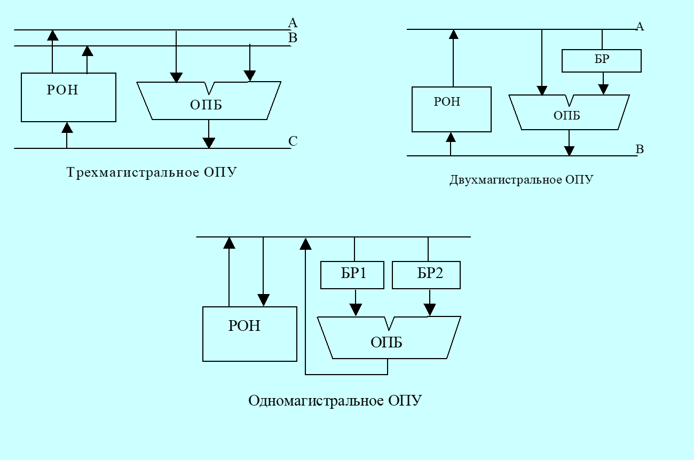

## Устройство управления

Устройство управления обеспечивает автоматическое выполнение команд программы. Оно формирует сигналы для:

1. Выборки очередной команды из оперативной памяти.
2. Дешифрации кода операции.
3. Формирования адресов операндов.
4. Выборки операндов из памяти.
5. Передачи операндов в операционное устройство.
6. Выполнения операции.
7. Передачи результата в память.
8. Ввода и вывода.
9. Реакции на запросы прерывания.

### Микрооперация, микрокоманда и микропрограмма

- **Микрооперация** — элементарное действие, выполняемое за один такт синхронизации.
- **Микрокоманда** — совокупность микроопераций, которые выполняются одновременно.
- **Микропрограмма** — последовательность микрокоманд, задающая порядок выполнения машинного цикла.
- **Микропрограммный автомат** вырабатывает сигналы управления с учётом команды, флагов и тактовых импульсов.

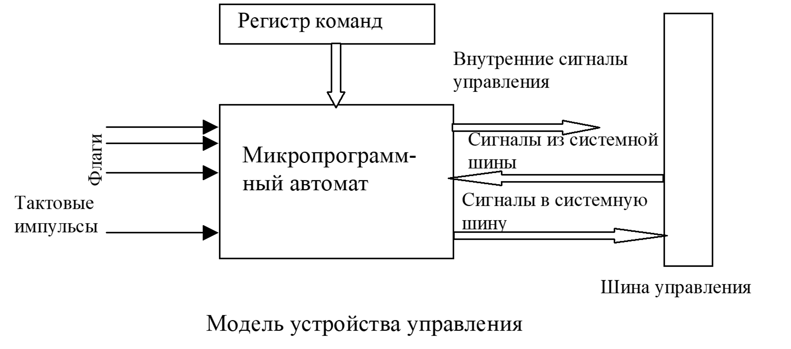

Устройство управления состоит из двух частей.

| Часть | Назначение | Состав |
| --- | --- | --- |
| Управляющая | Вырабатывает последовательность микрокоманд | Регистр команды, микропрограммный автомат и дешифратор команд, узел прерываний и приоритетов |
| Адресная | Формирует адреса команд и операндов | Операционный узел УУ, регистр адреса, счётчик команд |

### Автомат с жёсткой логикой

Управляющие сигналы формируют заранее соединённые логические схемы. На их работу влияют:

- код операции;
- номер текущего такта;
- флаги.

Каждая команда может занимать разное число тактов. На каждом такте формируется своя микрокоманда. После завершения команды счётчик тактов возвращается в начальное состояние `T1`.

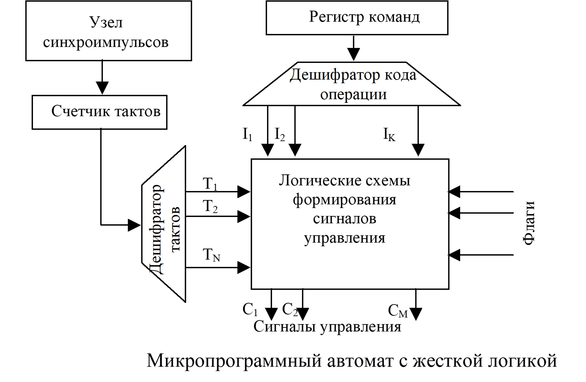

### Автомат с программируемой логикой

Главное отличие такого автомата — **память микропрограмм**. Каждой машинной команде соответствует микропрограмма.

Код операции помогает определить начальный адрес микропрограммы. Из памяти выбирается микрокоманда, её код дешифруется в управляющие сигналы. Затем формируется адрес следующей микрокоманды.

Идею микропрограммирования предложил Морис Уилкс в 1951 году.

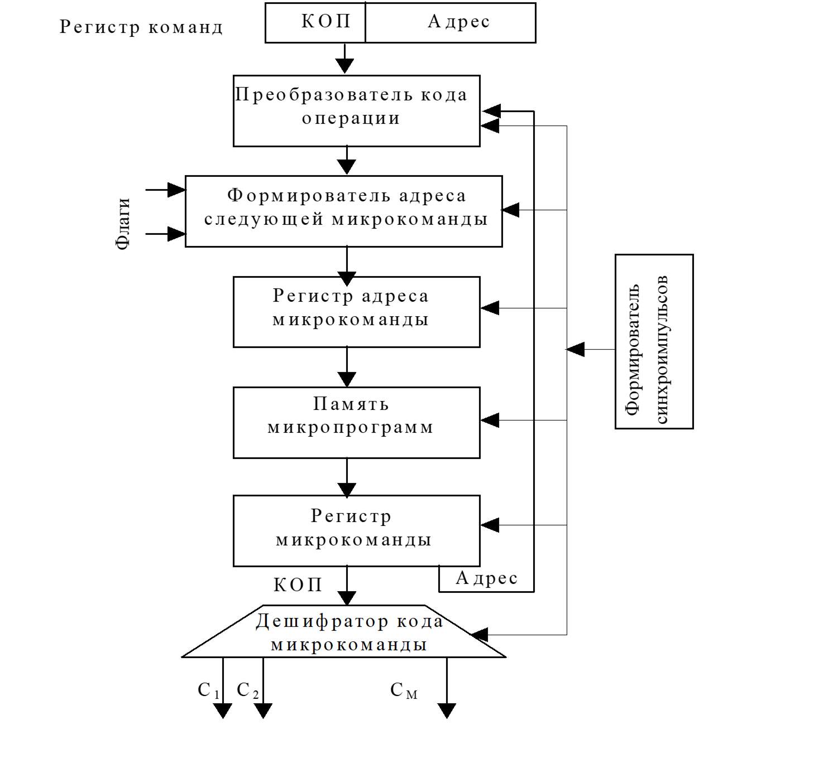

### Пример процессора с тремя шинами

В примере используются два формата микрокоманд:

- **GATE**: биты микрокоманды соответствуют управляющим стробам, то есть вентилям.
- **TEST**: задаются регистр, проверяемый бит, его значение `0` или `1` и адрес перехода в микрокоде.

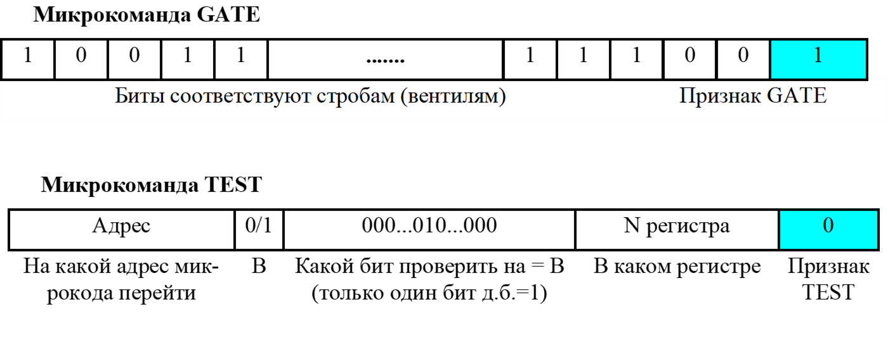

На следующей схеме сравниваются одноуровневая и двухуровневая реализации памяти микропрограмм. В двухуровневом варианте микропамять хранит коды, которые выбирают слова из нанопамяти.

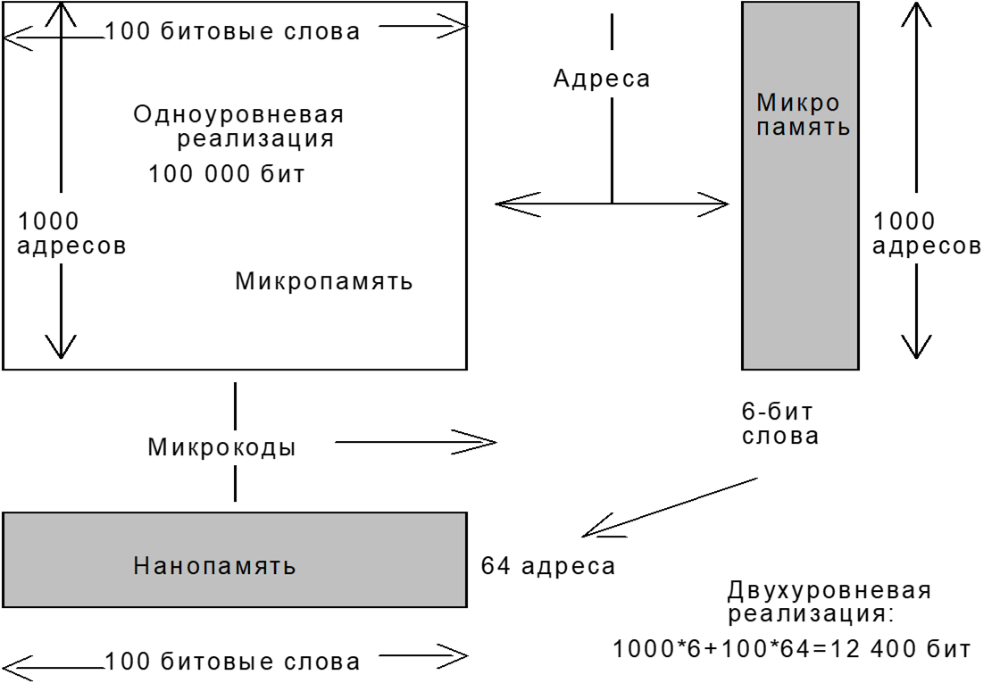

Внутренние шины `AB` и `BB` передают данные к сумматору, а `CB` возвращает результат. Вентили определяют, какой регистр подключён к шине. В тракт также входят инверторы и сдвигатель.

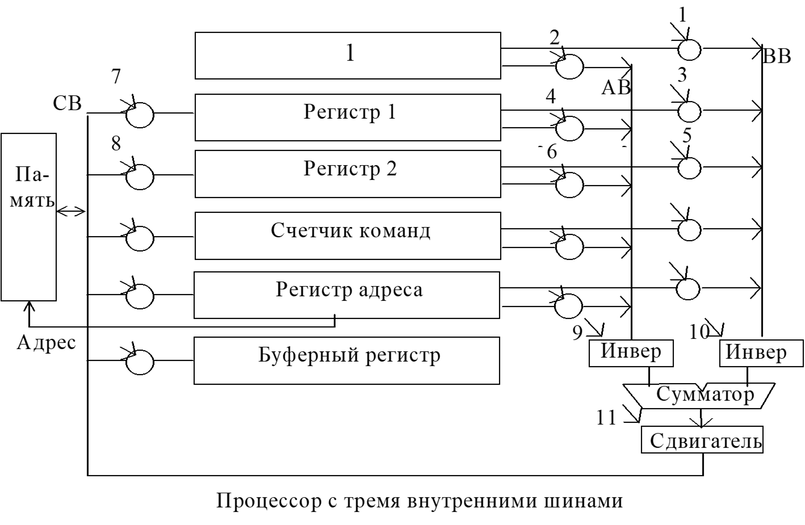

Таблица показывает, какие вентили нужно включить для сложения и инвертирования. Например, для сложения сначала открываются вентили 3 и 6, а затем вентиль записи результата: 7 для регистра 1 или 8 для регистра 2.

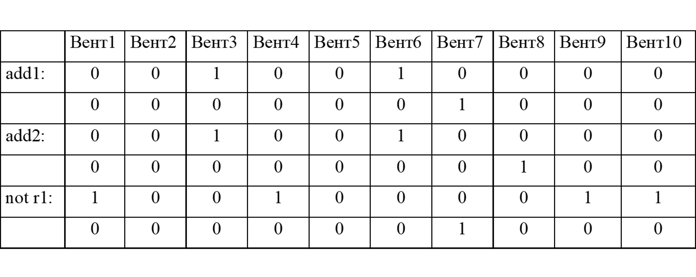

## Архитектуры системы команд

Архитектуры различают по тому, где находятся операнды и как процессор получает к ним доступ.

### Стековая архитектура

**Стек** работает по принципу **LIFO**: последним вошёл, первым вышел.

Основные операции:

- `push` — поместить данные на вершину стека;
- `pop` — извлечь данные с вершины стека.

Доступ через вершину стека уменьшает затраты на адресацию. Стек может быть программным или аппаратным. Аппаратный стек можно построить из регистров сдвига.

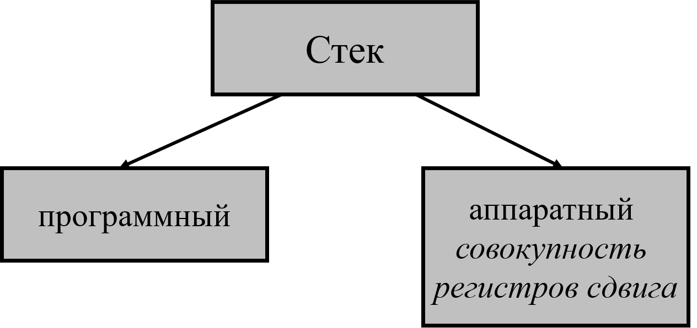

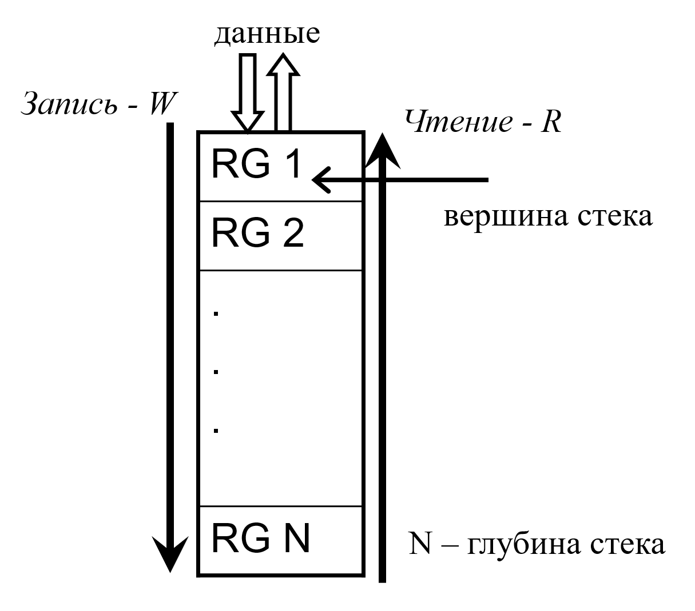

Для стековых вычислений используется **обратная польская запись**: знак операции ставится после операндов, скобки не нужны.

Пример из презентации:

    a = a + b + a × c
    a = a b + a c × +

### Аккумуляторная архитектура

**Аккумулятор** хранит один из операндов и результат операции.

Второй операнд считывается из памяти. После выполнения операции результат записывается в аккумулятор.

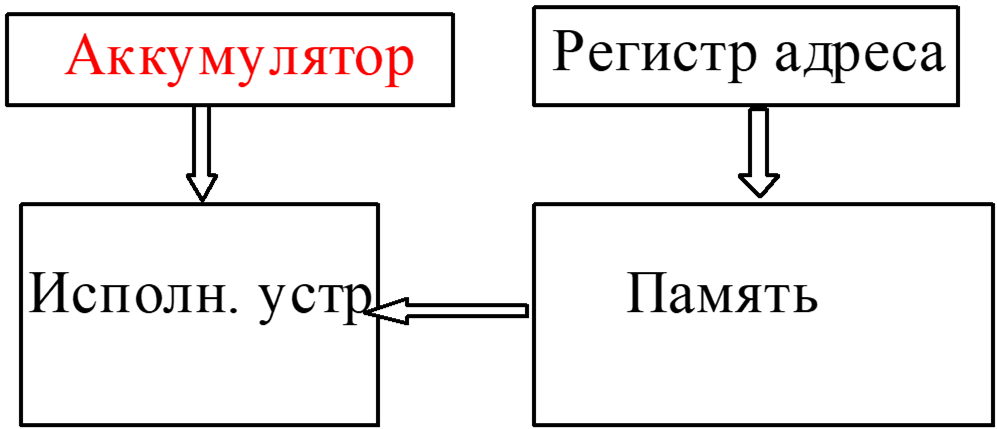

- `load x` загружает в аккумулятор содержимое ячейки `x`.
- `store x` сохраняет содержимое аккумулятора в ячейку `x`.

Преимущества: короткие команды и простое декодирование. Недостаток: из-за одного основного регистра приходится часто обращаться к памяти.

### Регистровая архитектура

В процессоре есть **регистровый файл**, то есть набор регистров общего назначения. К регистру можно обратиться по его номеру.

Размер регистра обычно совпадает с размером машинного слова. Регистры позволяют хранить часто используемые данные внутри процессора.

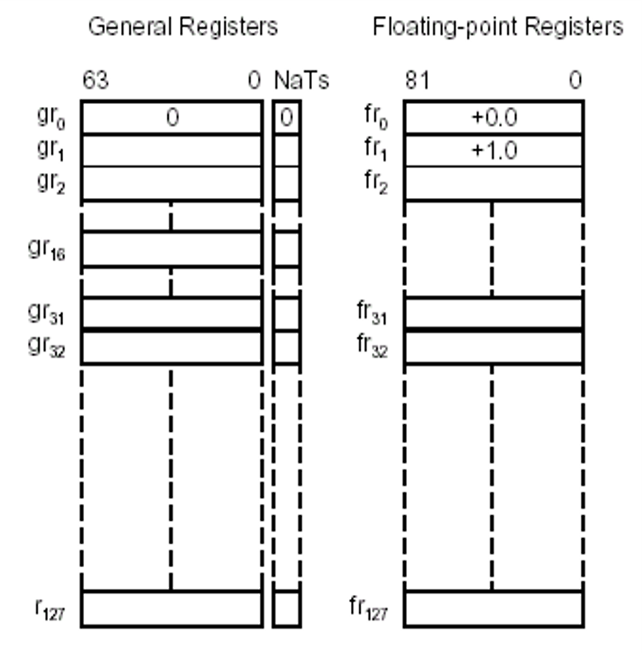

Возможны команды обработки трёх видов:

- регистр — регистр;
- регистр — память;
- память — память.

Преимущества: компактный код и высокая скорость за счёт обращений к регистрам. Команды при этом длиннее, чем в аккумуляторной архитектуре.

В презентации отмечается, что архитектуры RISC обычно предусматривают больше РОН, чем CISC.

### Архитектура с выделенным доступом к памяти

К памяти обращаются только две специальные команды:

- `load` читает данные из памяти в регистр;
- `store` записывает данные из регистра в память.

Все команды обработки используют операнды в регистрах и записывают результат в регистр. Прямого обращения к памяти в них нет.

Эта организация характерна для рассматриваемых в презентации RISC-процессоров: SPARC, MIPS, DEC Alpha и PowerPC.

На общей схеме также показаны CISC с полным набором команд, RISC с сокращённым набором и VLIW с командными словами большой длины.

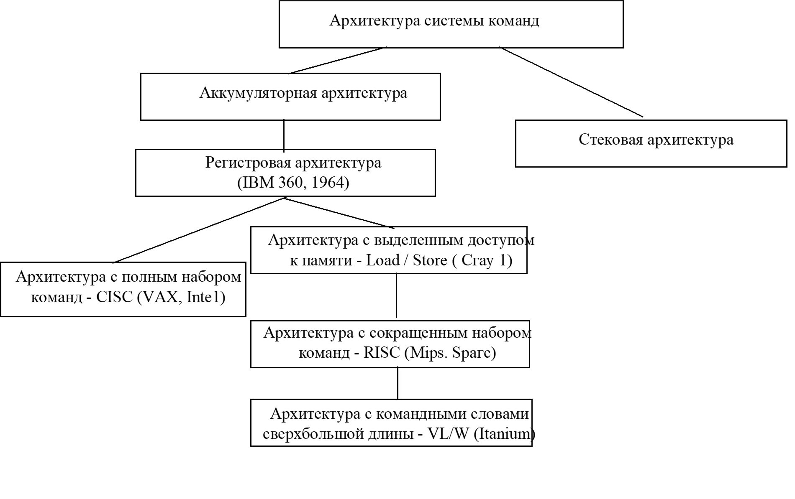

### Конфигурируемые процессоры

В презентации приведены процессоры **Xtensa** фирмы Tensilica и средство разработки **Xenergy**. Разработчик может менять конфигурацию ядра, добавлять команды и регистровые файлы, а затем оценивать энергопотребление процессора и связанной с ним памяти.

## Intel 8086: структура и регистры

В структурной схеме Intel 8086 выделены устройство обработки и устройство сопряжения с шиной.

На схеме показаны:

- регистры данных и адресов `AX, BX, CX, DX, SI, DI, SP, BP`;
- сегментные регистры `CS, SS, DS, ES`;
- указатель команд `IP`;
- регистр флагов;
- очередь команд на 6 байт;
- внутренняя шина на 16 бит;
- адресная шина на 20 бит и шина данных на 16 бит.

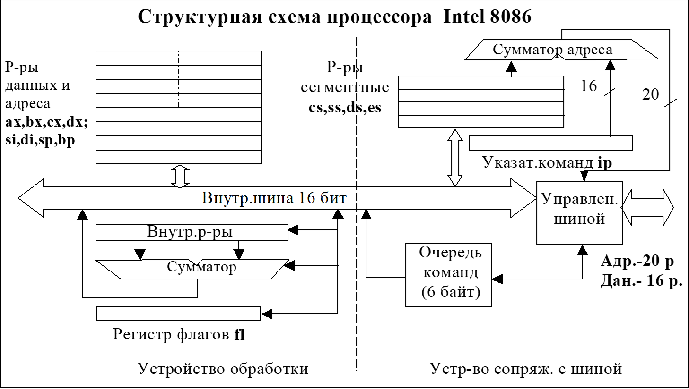

### Регистр флагов

Флаги отражают результат операций и задают отдельные режимы работы процессора.

| Флаг | Значение |
| --- | --- |
| `CF` | Перенос |
| `PF` | Чётность |
| `AF` | Вспомогательный перенос |
| `ZF` | Нулевой результат |
| `SF` | Знак |
| `TF` | Режим пошаговой отладки |
| `IF` | Разрешение прерываний |
| `DF` | Направление строковых команд |
| `OF` | Переполнение |

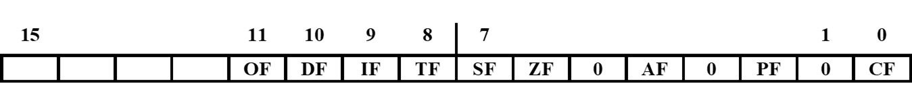

### Конвейер

Устройство сопряжения с шиной (УСШ) может выбирать следующую команду, пока устройство обработки (УО) выполняет текущую. На временной схеме видно перекрытие этих действий.

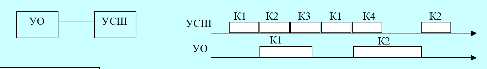

### Сегментная организация памяти

Память делится на сегменты:

| Регистр | Сегмент |
| --- | --- |
| `CS` | Код |
| `DS` | Данные |
| `SS` | Стек |
| `ES` | Дополнительный сегмент |

Полный адрес задаётся парой **сегмент:смещение**, например `DS:BX` или `0xB800:0`.

Физический адрес в рассматриваемой организации памяти:

    Физический адрес = значение сегментного регистра × 16 + смещение

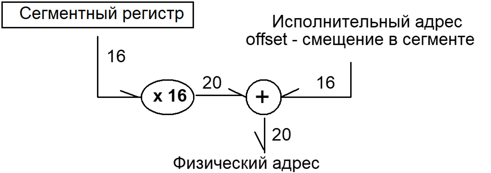

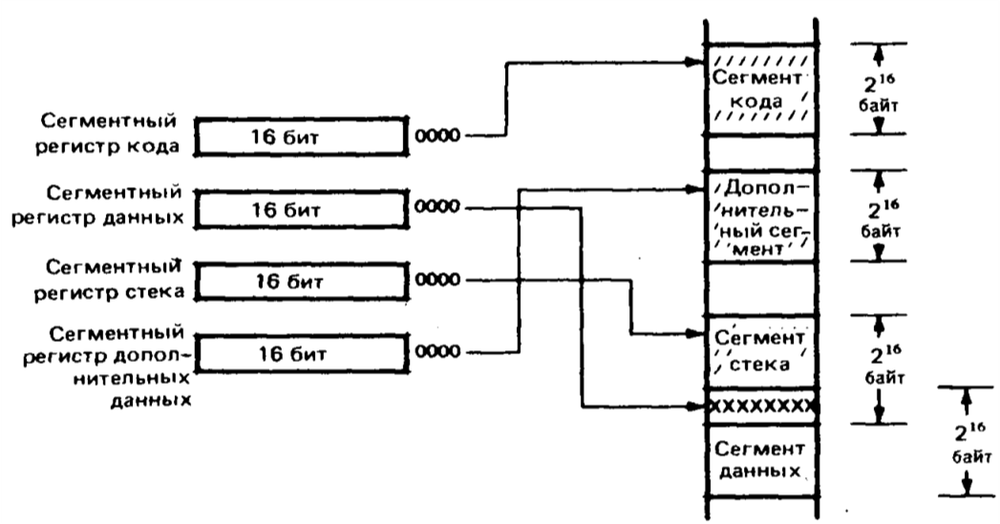

Для работы с адресами в презентации приведены `LEA` и `LES`. Также перечислены модели памяти: Tiny, Small, Medium, Compact, Large и Huge.

## Команды семейства x86

После схемы 8086 презентация рассматривает и команды более поздних процессоров семейства x86.

Для приведённых двухоперандных команд один операнд находится в регистре, второй — в регистре или памяти. Получатель результата может быть регистром или ячейкой памяти.

Семейство x86 относится к **CISC**. Для него в презентации отмечены сложное кодирование, составные способы адресации и специализация отдельных команд и регистров.

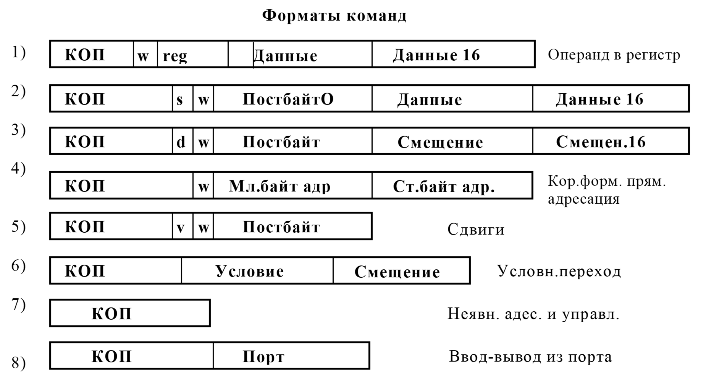

### Команды пересылки

| Команды | Назначение |
| --- | --- |
| `MOV` | Пересылка данных |
| `PUSH, POP` | Запись в стек и извлечение из стека |
| `LDS, LES, LFS, LGS, LSS` | Загрузка адреса и соответствующего сегментного регистра |
| `LEA` | Загрузка эффективного адреса |
| `MOVSB, MOVSW, MOVSD` | Пересылка элементов строки |
| `LODSB, LODSW, LODSD` | Загрузка элемента строки в `AL, AX, EAX` |
| `STOSB, STOSW, STOSD` | Сохранение `AL, AX, EAX` в строку |
| `CMOVcc` | Пересылка при выполнении условия по флагам |
| `BSWAP, XCHG` | Изменение порядка байтов или обмен операндами |
| `IN, OUT` | Обмен с портами периферийных устройств |

Пример обычной пересылки: `MOV eax, [ebx]`.

В показанной организации x86 указатель стека `(E)SP` указывает на последний занятый элемент.

При `REP MOVSB`:

1. Элемент из `DS:[E]SI` пересылается в `ES:[E]DI`.
2. Адреса увеличиваются при `DF = 0` или уменьшаются при `DF = 1`.
3. Счётчик `[E]CX` уменьшается на 1.
4. Пока счётчик не равен нулю, пересылка повторяется.

Префикс повторения вместе со `STOS` позволяет заполнить участок памяти одинаковыми элементами.

Для работы с системными регистрами приведены специализированные команды `LGDT, LIDT, LLDT, RDMSR, SGDT, SIDT, SLDT`.

В командах `IN` и `OUT` номер порта задаётся в команде в пределах 0–255 или через `DX`.

### Арифметические команды

| Команды | Действие |
| --- | --- |
| `ADD` | Сложение |
| `ADC` | Сложение с учётом переноса `CF` |
| `SUB` | Вычитание |
| `SBB` | Вычитание с учётом заёма `CF` |
| `CMP` | Сравнение вычитанием, результат не сохраняется, флаги изменяются |
| `NEG` | Смена знака |
| `INC, DEC` | Увеличение или уменьшение на 1 |
| `MUL, DIV` | Умножение и деление беззнаковых чисел |
| `IMUL, IDIV` | Умножение и деление чисел со знаком |

`INC` и `DEC` не изменяют `CF`. При умножении и делении в приведённых примерах используются также операнды двойной разрядности.

### Логические команды

| Команды | Действие |
| --- | --- |
| `OR` | Побитовое ИЛИ, позволяет устанавливать выбранные биты |
| `AND` | Побитовое И, позволяет сбрасывать выбранные биты |
| `XOR` | Исключающее ИЛИ, позволяет инвертировать выбранные биты |
| `TEST` | Проверка битов с изменением флагов |
| `NOT` | Инвертирование всех битов операнда |
| `BSF, BSR` | Поиск единичного бита и получение его номера |
| `BT, BTC, BTR, BTS` | Проверка выбранного бита с записью его значения во флаг |

Большинство команд обработки изменяет хотя бы часть флагов. Команды пересылки, рассматриваемые в презентации, признаков результата не изменяют.

### Сдвиги

Число сдвигов может быть равно 1, задаваться в `CL` или непосредственной константой.

| Команды | Вид сдвига |
| --- | --- |
| `ROL, ROR` | Циклический: вышедший бит возвращается с другого конца |
| `RCL, RCR` | Циклический с участием флага `CF` |
| `SAL, SAR` | Арифметический; при сдвиге вправо сохраняется знаковый бит |
| `SHL, SHR` | Логический; освободившиеся позиции заполняются нулями |
| `SHLD, SHRD` | Сдвиг двойного слова |

В презентации арифметические сдвиги связываются с умножением или делением на степень двойки.

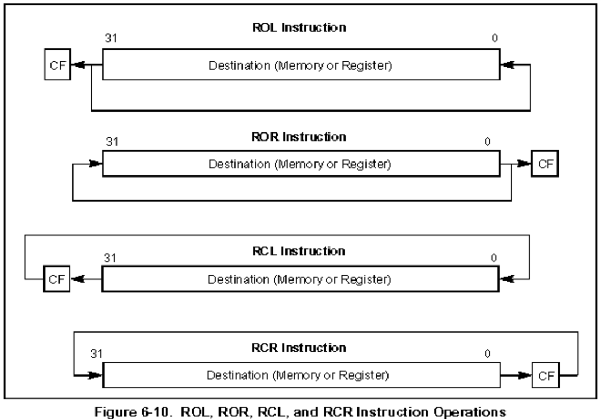

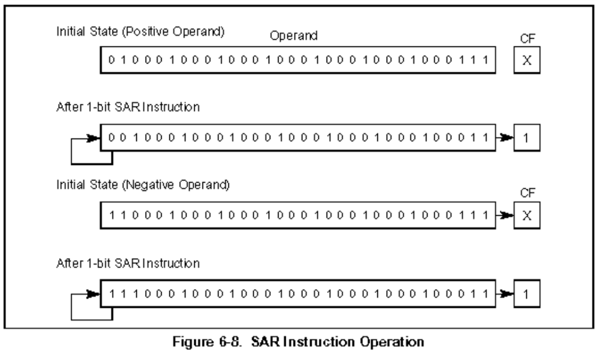

### Проверки и передача управления

- `CMP` сравнивает операнды, `CMPS` — элементы строк, `SCAS` — элемент строки с содержимым `AL, AX` или `EAX`.
- `Jcc` выполняет условный переход. Например, `JC` проверяет установленный `CF`, а `JNZ` — сброшенный `ZF`.
- `LOOP` организует цикл со счётчиком в `[E]CX`.
- `JMP` выполняет безусловный переход.
- `CALL` вызывает подпрограмму, `RET` возвращает из неё.
- `ENTER` создаёт стековый кадр, `LEAVE` освобождает его.

## Кодирование команд и адресация

Общий формат двухоперандной команды из презентации:

    [Префикс] КОП [Постбайт адресации] [Смещение] [Непосредственный операнд]

Части в квадратных скобках присутствуют, когда они нужны для конкретной команды.

**КОП** — код операции. Постбайт адресации описывает регистры и способ доступа к операндам. Префикс может задавать замену сегмента, повторение строковой команды, блокировку, размер адреса или операнда.

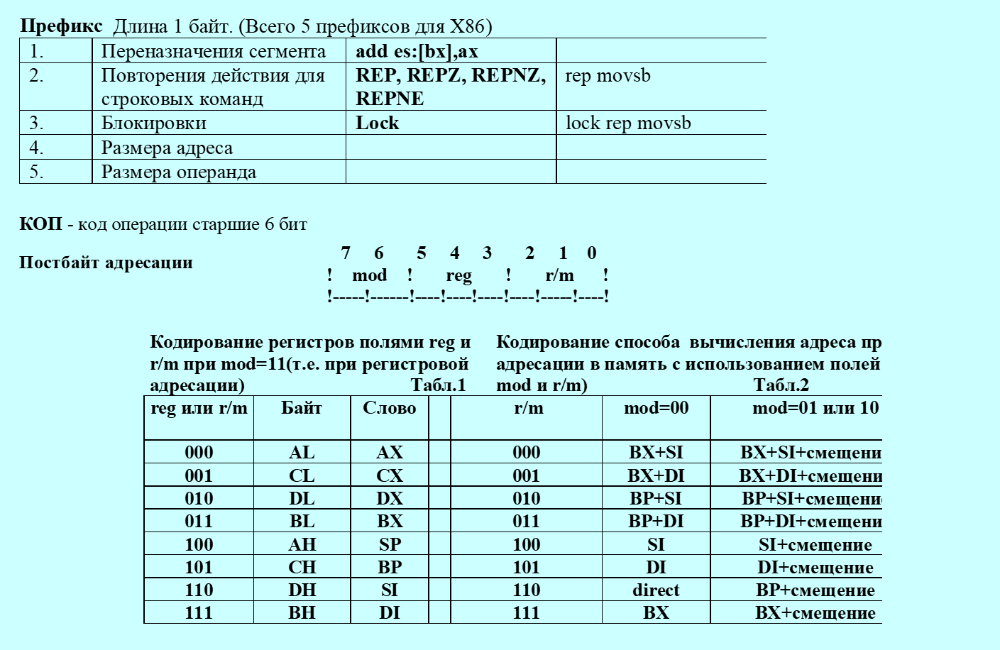

В полном формате также может использоваться байт **SIB**, который задаёт масштаб, индекс и базу адреса.

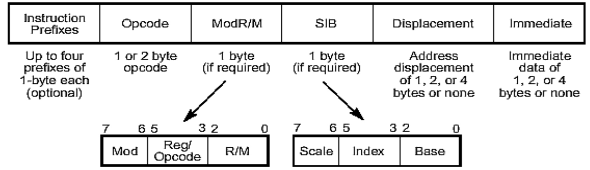

Пример из презентации:

    ADD [eax + 2*ebx], ecx
    00000001  00 001 100  01 011 000

Для вычисления смещения используются содержимое базового или индексного регистра и смещение `disp`. Полученное смещение прибавляется к адресу начала сегмента.

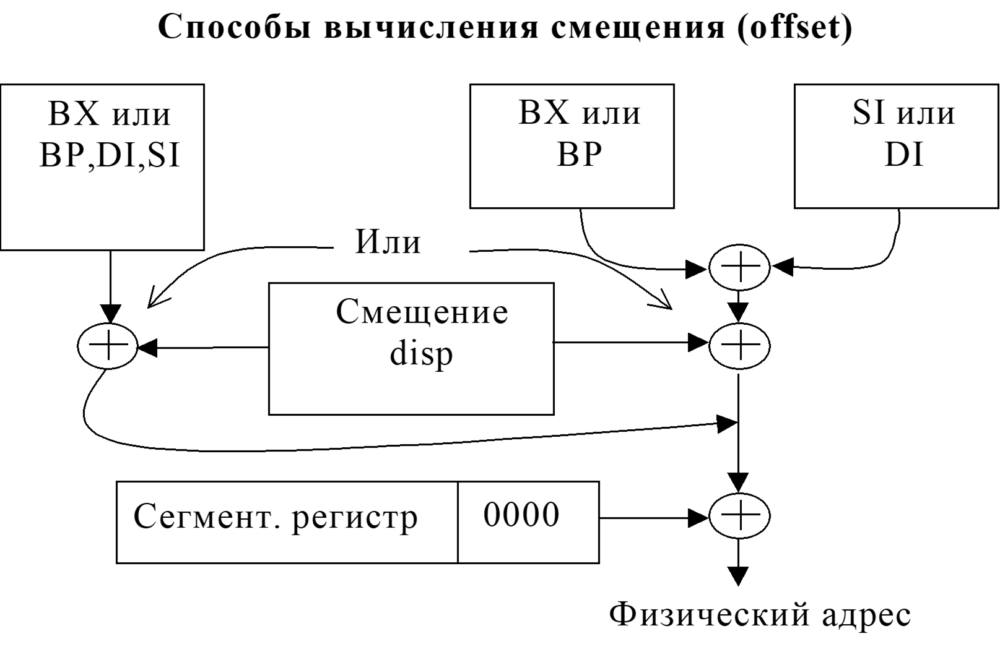

### Адресное пространство и память IBM PC

На схемах показано распределение памяти в реальном режиме адресации: таблица векторов прерываний, данные BIOS, программы и данные пользователя, видеопамять и области ПЗУ.

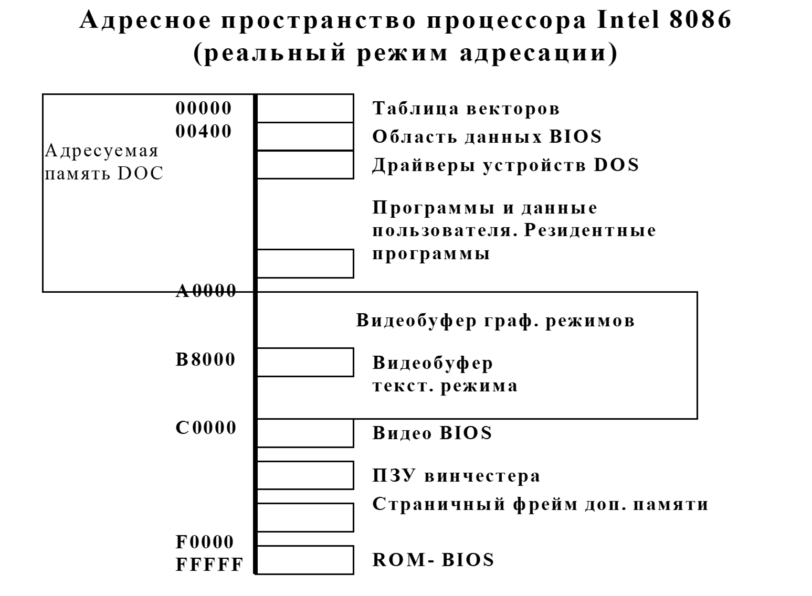

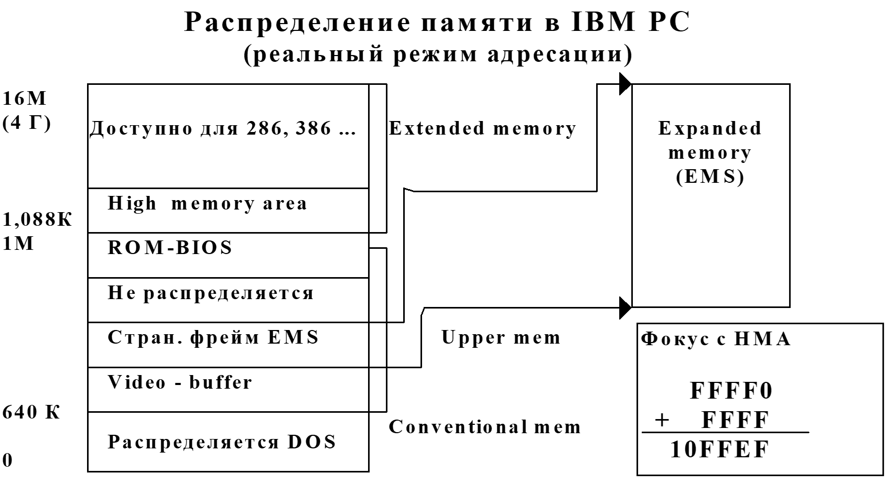

Обозначения из презентации:

- **EMS** — expanded memory, организация расширяемой памяти с использованием окна.
- **XMS** — стандарт управления extended memory.
- **UMB** — блоки верхней памяти.
- **Shadow RAM** — копирование данных из медленного ПЗУ в более быстрое ОЗУ.

В примерах для DOS приведены менеджеры памяти `EMM386.EXE`, `QEMM`, драйвер `HIMEM.SYS` и параметры `DOS=HIGH`, `DOS=HIGH,UMB`.

## Подпрограммы и контекст

В презентации сравниваются два способа структурирования программы:

- **Макроподстановка**: текст фрагмента подставляется на этапе компиляции.
- **Подпрограмма**: во время выполнения программа передаёт управление отдельному фрагменту, обменивается с ним данными и затем возвращается.

**Контекст программы** — значения, которые нужно сохранить и восстановить, чтобы продолжить её выполнение:

- счётчик команд и регистр флагов;
- остальные регистры процессора;
- указатели стеков;
- указатели адресного пространства задачи;
- переменные и промежуточные результаты.

### Вызов и возврат

Команда `CALL` или `JSR` как минимум:

1. Сохраняет адрес возврата — адрес команды после вызова.
2. Загружает в счётчик команд адрес первой команды подпрограммы.

Команда `RET` или `RTS` возвращает управление вызывающей программе.

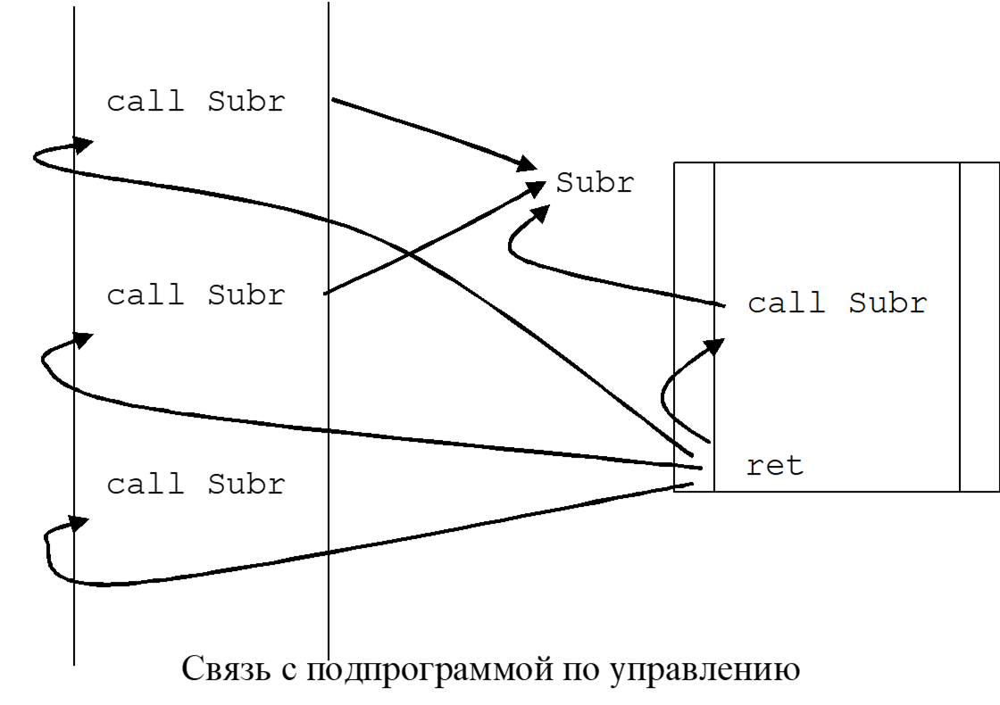

Вложенные вызовы позволяют одной подпрограмме обращаться к другой. В приведённом примере `main` вызывает `proc1`, она вызывает `proc2`, а та — `proc3`.

Для каждого вызова нужен свой адрес возврата. На схемах показано, какие данные сохраняются в стеке при ближнем и дальнем вызовах и извлекаются при возврате.

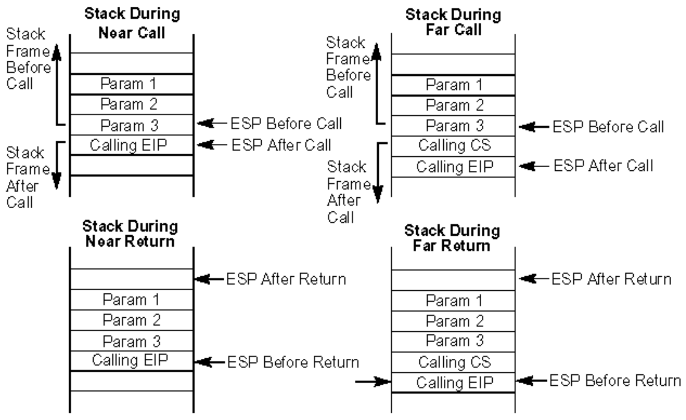

### Сохранение и восстановление контекста

В разных процессорах эта задача решается по-разному:

- специальными командами, например `PUSHA` и `POPA` в x86;
- несколькими наборами регистров;
- рабочими областями в памяти, как в примере TMS9900;
- стековой организацией регистров;
- динамическим переименованием регистров, как в примере IA-64.

В презентации для сохранения регистров x86 приведён порядок `(E)AX, (E)CX, (E)DX, (E)BX, (E)SP, (E)BP, (E)SI, (E)DI`. Значение `(E)SP` берётся до начала выполнения команды сохранения.

### Передача данных

Подпрограмме можно передавать сами данные или адрес области памяти с данными.

Способы передачи:

- через регистры;
- через стек;
- через заранее оговорённое место памяти.

Пример функции из презентации:

    int addition(int x, int y) {
        int iX, iY;
        iX = 2*x + y;
        iY = 3*y - x;
        return iX*iY;
    }

Таблица дизассемблирования показывает сохранение `BP`, создание кадра, доступ к параметрам и локальным переменным, получение результата и возврат из процедуры.

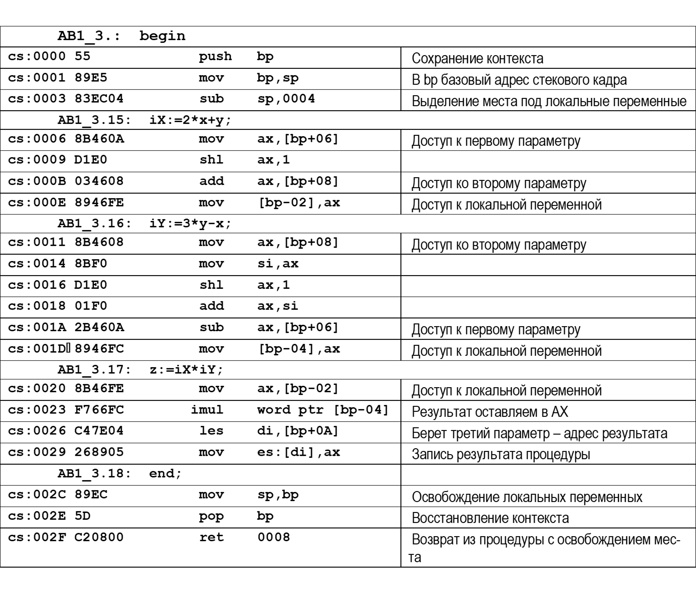

### Стековый кадр

**Стековый кадр** — область стека, связанная с отдельным вызовом подпрограммы.

В показанной структуре кадра есть:

- ссылка на предыдущий кадр — динамическая связь;
- таблица указателей на ранее созданные кадры — индикатор;
- локальные переменные.

Для доступа к элементам кадра используется `BP`. `SP` задаёт текущую позицию в стеке.

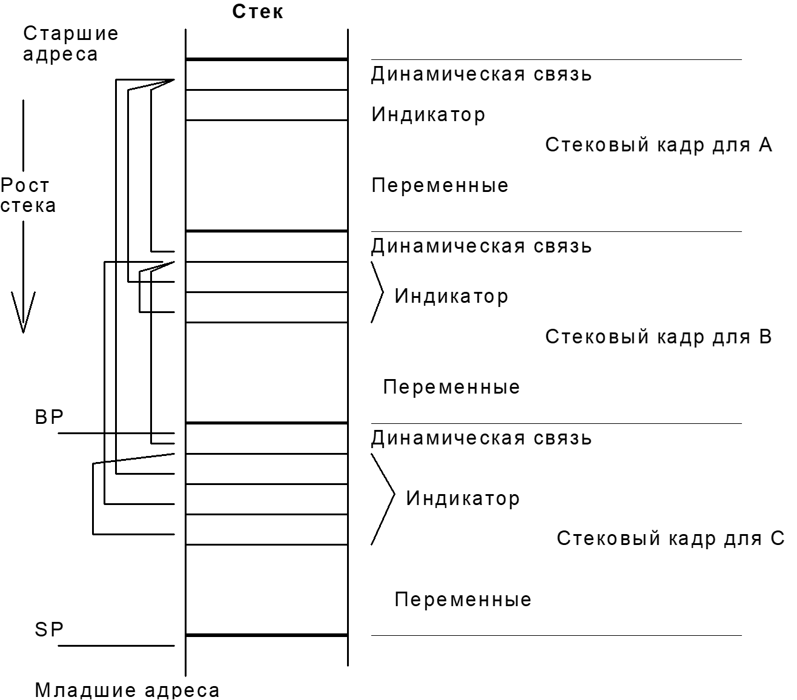

Команда `ENTER frmsiz, level` создаёт кадр:

- `frmsiz` — число байтов для локальных переменных;
- `level` — уровень вложенности, используемый при построении индикатора.

Последовательность из презентации:

1. Запомнить `SP` во временном регистре.
2. Поместить старое значение `BP` в стек.
3. Скопировать нужные ссылки из предыдущего кадра.
4. Добавить ссылку на новый кадр.
5. Установить `BP` на начало создаваемого кадра.
6. Уменьшить `SP` на `frmsiz`, выделив место для локальных переменных.

`LEAVE` освобождает стековый кадр. `RET` выполняет возврат из подпрограммы.
